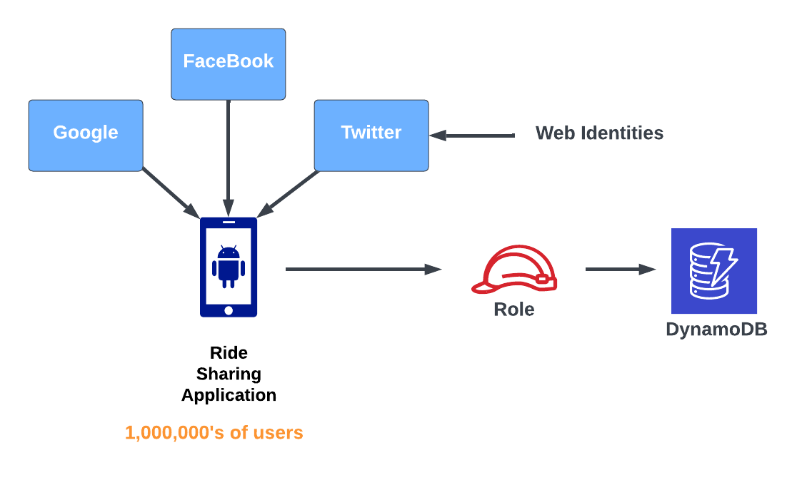
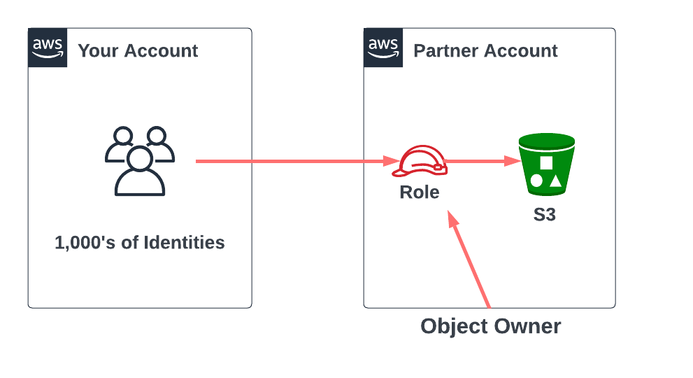
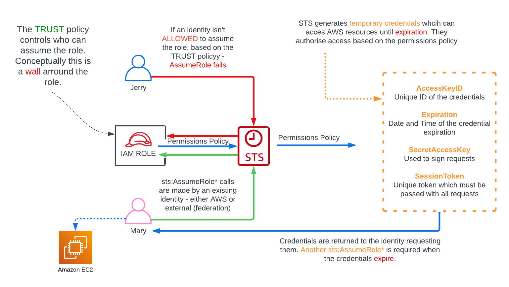
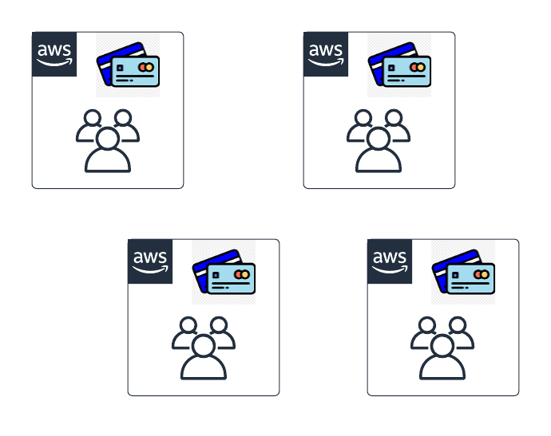
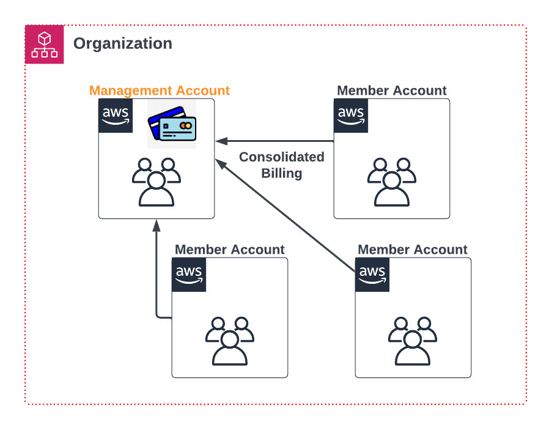

# IAM, ACCOUNTS, and AWS ORGANIZATIONS

## IAM Identity Policies

An identity policy in AWS IAM determines the permissions and access rights for users or groups. It specifies the actions and resources they can access in AWS. Identity policies ensure secure and controlled access to AWS services, following the principle of least privilege.

```json
{
  "Version": "2012-10-17",
  "Statement": [
    {
      "Effect": "Allow",
      "Action": [
        "s3:GetObject",
        "s3:PutObject",
        "dynamodb:GetItem",
        "dynamodb:PutItem",
        "dynamodb:DeleteItem"
      ],
      "Resource": [
        "arn:aws:s3:::example-bucket/*",
        "arn:aws:dynamodb:us-east-1:123456789012:table/example-table"
      ]
    }
  ]
}
```

This single statement allows the following actions on resources:

- `s3:GetObject` and `s3:PutObject` on objects within the "example-bucket" S3 bucket.
- `dynamodb:GetItem`, `dynamodb:PutItem`, and `dynamodb:DeleteItem` on the "example-table" DynamoDB table in the US East (N. Virginia) region.

### Handle Overlap in Access

- Explicit Deny - Overrules everthing else
- Explicit Alow - Take effect unless there is an explicit Deny (Deny always wins)
- Default Deny (Implicit)

<br>

## IAM Users and ARNs

### IAM Users

IAM Users are one of the identity types available inside AWS.

They are type you pick when you can identify a single individual or 'thing' which will use that identity - a person, an application or a service account.


### ARNs

Amazon Resource Name (ARN)

- Uniquely identify resources within any AWS accounts.

```
arn:partition:service:region:account-id:resource-id
arn:partition:service:region:account-id:resource-type/resource:id
arn:partition:service:region:account-id:resource-type:resource:id

arn:aws:s3:::doggifs        // Buckets
arn:aws:s3:::doggifs/*      // Objects in the bucket
```

### Exam Tips  

- _5,000 IAM Users per account_ *
- IAM Users can be a member of 10 groups 
- This has systems design impacts...
- Internet-scale application
- Large orgs & org merges
- IAM Roles & Identity Federation fix this (more on this later)

## IAM Groups

IAM Groups are containers for Users

- Groups can have Policies attached to them (Inline and Managed)

.png)

## IAM Roles

### When to use IAM Roles

**Web Identities**  

Advantages of Roles in this situation:

- No AWS Credentials on the app
- Uses Existing customers logins 
- Scales to 1000,000,000's of accounts



<br>

**Cross Account Access**  

- Use role in partner accounts
- Your users can assume that role, and get temporary user credentials, and use those to upload objects.
- Because the IAM Role in the partner account is an identity in that account, then using that role means that any objects that you upload to that bucket are owned by the partner account.




## Security Token Service (STS)

- Generates temporary credentials (sts:AssumeRole*)
- They expire and don't belong to the identity
- Limited access
- Used to access AWS resources
- Requested by an identity (AWS or EXTERNAL)




## AWS Organizations 

AWS Organizations is a product which allows larger businesses to manage multiple AWS accounts in a cost-effective way.

Without AWS organizations, a business with multiple AWS accounts would need to have its own pool of IAM Users for each account, and separate payment methods:




With a standard AWS account (AWS account that is not in an organization), you create an AWS Organization.

- The organization isn't in the AWS account, you just use the account to create the Organization
- This account that you used to create the Organization becomes the _**Management Account**_
- Using this management account, you can invite other existing standard AWS account into the organization
- These account will need to approve the invite to join the org. These account will become part of the organization.
- When these account join the organization, then change from **_standard accounts_** to _**member accounts**_ of that organization 



- You can also create new accounts directly withing the organization (Just need unique email)
- Adding accounts in this way means there is no invite process
- With orgs, you don't need to have IAM User inside every AWS account. Instead, AWS Roles can be used to allow IAM User to access other AWS accounts