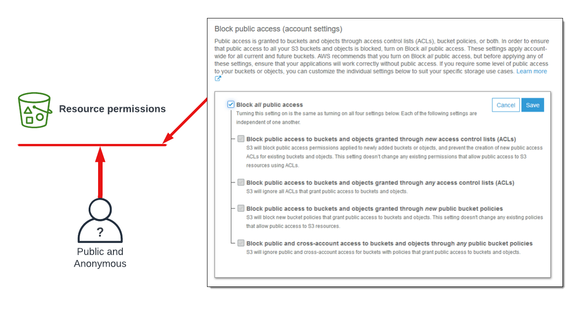

# SIMPLE STORAGE SERVICE (S3)

<hr>

## The Basics - Summary

 - Bucket name are _globally unique_
 - 3 - 63 characters, all lowercase, no underscores
 - Start with a lowercase letter or a number
 - Can't be IP formatted e.g. 1.1.1.1
 - Buckets - 100 softer limit, 1000 hard per account
 - Unlimited objects in a bucket, 0 bytes to 5TB
 - Key = Name, Value = Data
 - S3 is an object store - note file or block
 - You CAN:T MOUNT an S3 bucket as (K:\ or /images)
 - Great for large scale data storage, distribution or upload
 - INPUT and/or OUTPUT to MANT AWS products
 - All S3 object and buckets are private by default

<br>
<hr>

## S3 Security (Resource Policies and ACLs)

**_S3 is private by default_**

- The only identity that has any initial access to an S3 bucket is the account root user of the account which owns that bucket
-  Any other permissions have to be explicitly granted

### S3 Bucket Policies

- A form of _**resource policy**_
- Like identity policies but attached to a bucket
- Resource perspective permissions (control who can access a resource)
- ALLOW/DENY same or different accounts 
- ALLOW/DENY anonymous access 

Example bucket policy:

```json
{
  "Version": "2012-10-17",
  "Statement": [
    {
      "Sid": "PublicReadAccess",
      "Effect": "Allow",
      "Principal": "*",
      "Action": [
        "s3:GetObject"
      ],
      "Resource": [
        "arn:aws:s3:::your-bucket-name/*"
      ]
    }
  ]
}
```

_A resource policy can be differentiated from an identity policy by the presence of an explicit Principle field._

The above example allows _**any Principle**_ to perform the action `s3:GetObject` on any object inside the bucket

Any Principle (*) means identities within the same account, identities, from partner/member accounts, and importantly, it also applies to Anonymous Principles (Principle that haven't authenticated to AWS)

### Access Control Lists (ACLs)

- ACLs on objects and buckets
- A subresource
- Legacy _**(AWS don't recommend their use - Use bucket or identity policies)**_
- Inflexible and Simple permissions

### Block Public Access Settings

These setting only applies to the public access, not any other defined AWS identities.



<br>
<hr>

## S3 Static Website Hosting 

- This feature allows access via HTTP e.g. blogs, webpage, etc
- _**Index**_ and **_Error_** documents are set
- **_Website Endpoint_** is created when the Static Website Hosting feature is enables 
- **_Custom Domain_** via R53 - The bucket name matters (Domain must match bucket name)

There are two scenarios which S3 is ideal for:

### Offloading

Compute services tend to be relatively expensive, so you can offload all the media and move it to an S3 bucket that uses static website hosting 


When the compute service generates the HTML file and delivers this to the customers browser, this HTML file points to the media that is stored in the S3 bucket.

### Out-of-band Pages

If you want to display a maintenance page during scheduled or unscheduled maintenance, it doesn't make sense to have this on the same server (because the server will be down)

When a service is down or under maintenance, we can change the DNS and point the user to a backup static website hosted on S3


_** To transfer data in to S3 is free, out is per/GB charge_

_** Charged everytime you make a request (perform operation)_

<br>
<hr>

## Object Versioning and MFA Delete

Object versioning is controlled at a bucket level

- It starts out as disabled
- you can optionally enable bucket versioning
- However, you can not disable versioning once enabled.
- You can suspend versioning 


- Without versioning on a bucket, each object in identified by the object key (name).
- If you modify an object, the original is replaced
- Versioning lets you store **_multiple versions_** of an object in a bucket
- Operations which would modify objects **generate a new version** 


<br>

**Version also impacts deletions**


**Important Points**

- Versioning can not be switched of, it can only be suspended
- Space is consumed by ALL versions and you are billed for ALL versions
- The only way to zero costs is to delete the bucket

**MFA Delete**

MFA is enabled in **_versioning configuration_**

When enabled:

- MFA is required to change bucket versioning state
- MFA is required to delete versions
- Serial number (MFA) + Code passed with API calls

<br>
<hr>

## Performance Optimization 

### Single PUT Upload

The default way that S3 uploads occur (single blog of data)

- If the stream fails, the upload fails
- Required a full restart
- The speed and reliability = limit of stream
- Any upload ip to 5GB


_There is a better solution for large amounts of data (Multipart Upload)_*

### Multipart Upload

- Data is broken up
- Minimum data size is 100MB for mutipart
- 10,000 max parts (Parts can range in size 5MB -> 5GB)
- Last part can be smaller than 5MB
- Parts can fail in isolation, and be restarted


### S3 Accelerated Transfer

S3 Transfer Acceleration is a feature of Amazon S3 that speeds up data transfers to and from S3 buckets by routing the traffic through CloudFront edge locations, reducing latency and improving transfer speeds. It requires enabling the feature for the S3 bucket and using a special endpoint for accelerated transfers.

<br>
<hr>

## S3 Server-Side Encryption (SSE) 

**_Buckets aren't encrypted, objects are_**

There are two kinds encryption architecture that can be used with S£:

### Client-Side Encryption

Note: Both of these methods also use encryption in transit between the user and S3(HTTPS - encrypted tunnel)


- The objects being uploaded are encrypted by the client (Ciphertext the entire time)
- The data is recieved in scrabbled form - AWS never sees the data in its plain text form

### Server-Side Encryption


- Even though data is encrypted in transit with HTTPS, the object themselves are not initially encrypted.
- Inside the tunnel, the data is in original form (plain text)
- Encrypted by S3 servers

### 3 Types of S3 Server-Side Encryption

**Server-Side Encryption with Customer-Provided Keys (SSE-C)**


**Server-Side Encryption with Amazon S3 Managed Keys (SSE-S3)(Default)**


### Summary

| Method                     | Key Management | Encryption Processing | Extras                                |
|----------------------------|----------------|-----------------------|---------------------------------------|
| **Client-Side Encryption** | YOU            | YOU                   | S3 Server never sees plaintext        |
| **SSE-C**                  | YOU            | S3                    | Value                                 |
| **SSE-S3**                 | S3             | S3                    | No KEY Control, No role separation    |
| **SSE-KMS**                | S3 and KMS     | S3                    | Key Rotation Control, Role separation |
